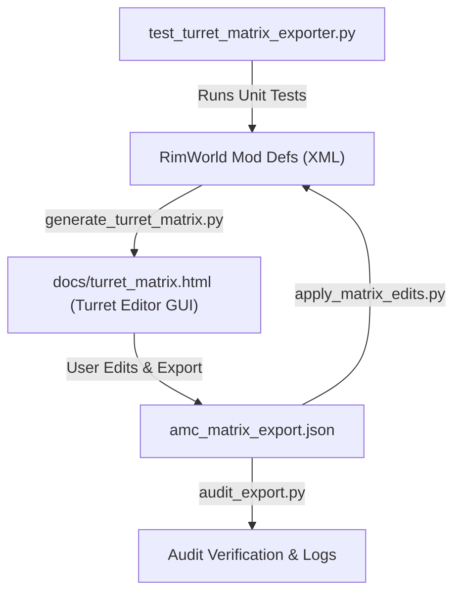

# Turret Editor & DevTools Suite

> [!NOTE]
> This document describes the **Turret Editor** dashboard and the accompanying `DevTools` workflow used in **Absolutely More Cannons - CE Version 1.6**. It serves as a comprehensive guide for developers and modders to inspect, audit, edit, and maintain turret definitions efficiently.

---

## 1. Project Context & Background

### What is Absolutely More Cannons (CE Version)?
**Absolutely More Cannons - CE Version 1.6 (AMC-CE)** is a heavy artillery, naval gun, autocannon, and automated defense mod created for RimWorld 1.6, fully integrated with **Combat Extended (CE)**. It introduces realistic ballistics, caliber-based ammunition sets, direct/indirect fire modes, Fire Control Systems (FCS), dynamic smoke emission, and multi-barrel recoil and spinning animations.

### What are "Turrets" in AMC-CE?
In AMC-CE, turrets are complex XML-defined structures comprising two interconnected `ThingDef` specifications along with custom C# mod extensions:

1. **Building `ThingDef`**: Defines the physical turret structure built on the map—its hit points (HP), build cost, mass, bulk, power consumption, UI menu icons, and whether it is manned or unmanned (`AMCTurretMannedBase` vs. `AMCTurretAutoBase`).
2. **Weapon `ThingDef`**: Defines the gun attached to the turret building—its sight efficiency, spread, sway, cooldown, burst count, warmup time, verb class, and linked CE `AmmoSetDef`.
3. **Custom C# Components & Extensions**:
   - **Mode-Swap Engine** (`CompProperties_TurretModeSwap`): Enables dual-mode turrets to switch between Direct Fire and Indirect Fire (artillery mode) in-game.
   - **Fire Control System (FCS)** (`CompProperties_TurretFCS`): Provides lead calculation, sight accuracy overrides, and target locking.
   - **Turret Barrel Extensions** (`TurretBarrelExtension`): Handles custom barrel offsets, multi-barrel recoil animations, firing animations, and Gatling/rotary spin-up and spin-down routines (`spinningAnimation`).
   - **Dynamic Turret Smoker** (`CompProperties_TurretSmoker`): Generates muzzle smoke bursts, rapid-fire heat smoke decay, and ground shockwave particles.
   - **Accuracy & Immunity Extensions** (`CompProperties_AccuracyOverride`, `TurretSuppressionImmunityExtension`).

### How Turrets are Written in XML
Turret definitions reside in `Common/Defs/ThingDefs_Buildings/` organized by category (e.g., `Autocannons`, `Howitzers`, `NavalGuns`, `Unmanned`, `Rotary`). Hand-editing dozens of complex XML files across direct and indirect modes is prone to human error and XML schema syntax mismatches. The **Turret Editor** suite solves this problem by providing a graphical web dashboard and an automated synchronization pipeline.

---

## 2. DevTools Architecture Overview

The `DevTools/` directory contains an end-to-end Python & HTML visual editor pipeline:

```
DevTools/
├── generate_turret_matrix.py   # Scans XML defs, parses database, and generates HTML editor
├── matrix_template.html        # HTML5/JS template for the interactive visual matrix dashboard
├── apply_matrix_edits.py       # XML Sync Engine: applies JSON matrix edits back to XML files safely
├── audit_export.py             # Diagnostic tool: audits XML integrity & JSON schema alignment
├── test_turret_matrix_exporter.py # Automated unit test suite verifying single-line XML diff precision
└── amc_matrix_export.json      # Export payload file generated from the web dashboard
```



---

## 3. Tool Description & Key Features

### A. Matrix Generator (`generate_turret_matrix.py`)
- **XML Parsing**: Deep-scans all XML files in `Common/Defs/ThingDefs_Buildings/` and merges parent base template attributes (`AMCTurretMannedBase`, `AMCArtilleryBase`, etc.).
- **System Pairing**: Automatically pairs dual-mode direct and indirect turrets linked via `CompProperties_TurretModeSwap`.
- **Diagnostic Rules**: Checks for missing texture files, broken `swapAltDef` links, missing FCS on unmanned turrets, and missing `ai_combatDangerous` flags.
- **Output**: Compiles the parsed mod database into `docs/turret_matrix.html`.

### B. Interactive Web Dashboard (`docs/turret_matrix.html`)
The **Turret Editor** is a standalone, rich HTML5 application that runs locally in any modern browser:
- **Search & Filter Grid**: Filter turrets by caliber (mm), system type (Dual-Mode, Direct Only, Indirect Only), manned/unmanned status, or warning alerts.
- **Building Stats Editor**: Live editing of `MaxHitPoints`, `WorkToBuild`, `Mass`, `Bulk`, `constructionSkillPrerequisite`, `turretBurstCooldownTime`, and `basePowerConsumption`.
- **Weapon & Verb Editor**: Modify `SightsEfficiency`, `ShotSpread`, `SwayFactor`, `RangedWeapon_Cooldown`, `burstShotCount`, `ticksBetweenBurstShots`, and `warmupTime`.
- **Feature & Animation Sub-editors**:
  - **Rotary Spinning Animation**: Toggle Gatling/rotary spin-up and spin-down routines (`maxRPM`, `spindownTime`, `frameCount`, `spinUpSound`).
  - **Turret Smoker Controls**: Toggle muzzle smoke velocity, heat smoke thresholds, and shockwave radius/density.
  - **Accuracy & FCS Overrides**: Adjust sway, recoil, and spread reduction factors.
  - **Selectable Burst Counts**: Configure customizable burst fire modes (e.g., `[3, 5, 10]`).
- **Real-Time Diff & JSON Exporter**: Visualizes raw XML changes live and exports modifications into `amc_matrix_export.json`.

### C. XML Sync Engine (`apply_matrix_edits.py`)
- **Targeted XML Ingestion**: Reads `amc_matrix_export.json` and updates the exact `<ThingDef>` blocks inside source XML files without reformatting unrelated XML lines.
- **Automatic Backup System**: Creates `.xml.bak` copies of target XML files before committing modifications.
- **Dry-Run & Rollback**:
  - `--dry-run`: Preview file modifications without altering disk files.
  - `--rollback`: Instantly restore all XML files from `.xml.bak` backups in case of error.

### D. Audit & Test Suite (`audit_export.py` & `test_turret_matrix_exporter.py`)
- **`audit_export.py`**: Validates JSON payloads against raw XML strings and verifies produced XML files on disk.
- **`test_turret_matrix_exporter.py`**: Automated `unittest` suite ensuring single-line XML diff precision, rotary animation block injection, smoker comp export, and schema compliance.

---

## 4. How to Use the Turret Editor (Developer & User Workflow)

> [!IMPORTANT]
> Ensure Python 3.8+ is installed on your system before using the DevTools CLI scripts.

### Step 1: Generate or Refresh the Turret Matrix Editor
Run the generator script to compile the latest XML definitions into the HTML dashboard:

```powershell
python DevTools/generate_turret_matrix.py
```

*Output:*
`Successfully generated HTML Turret Matrix Editor at: docs/turret_matrix.html`

---

### Step 2: Open and Edit Turrets in the Graphical Web UI
1. Open `docs/turret_matrix.html` in your web browser (Chrome, Firefox, Edge).
2. Use the search bar or filter buttons to locate the target turret (e.g., *20mm Flak 38*, *155mm GCT Howitzer*, *M61 Vulcan*).
3. Expand a turret card to modify stats:
   - Adjust building HP, construction work, or power consumption.
   - Fine-tune weapon spread, cooldown, burst shot count, or warmup duration.
   - Configure smoker particle effects or rotary spinning animation parameters.
4. Click **Export Matrix Edits (JSON)** at the top right of the dashboard.
5. Save the downloaded JSON file to `DevTools/amc_matrix_export.json`.

---

### Step 3: Preview and Apply Edits to XML Source Files

#### Preview Changes (Dry-Run Mode):
Before modifying source files, run a dry run to inspect affected XML files:

```powershell
python DevTools/apply_matrix_edits.py --dry-run DevTools/amc_matrix_export.json
```

#### Apply Changes to XML:
Apply the edits to the actual `.xml` files on disk:

```powershell
python DevTools/apply_matrix_edits.py DevTools/amc_matrix_export.json
```

> [!TIP]
> `apply_matrix_edits.py` automatically creates `.xml.bak` backups of all modified files.

---

### Step 4: Run Audits and Automated Tests

Run the audit script to verify XML syntax and parameter alignment:

```powershell
python DevTools/audit_export.py
```

Run the unit test suite to ensure exporter integrity:

```powershell
python DevTools/test_turret_matrix_exporter.py
```

---

### Step 5: Rolling Back Changes (Emergency Restoration)

If any unintended XML corruption or invalid stat changes occur, restore all XML source files to their original pre-edited state instantly:

```powershell
python DevTools/apply_matrix_edits.py --rollback
```

*Output:*
`[OK] Rollback complete: Restored X XML file(s).`

---

## 5. Maintenance Summary Table

| Tool Script / File | Primary Purpose | Key Command / Usage |
| :--- | :--- | :--- |
| `generate_turret_matrix.py` | Scans XML defs and outputs HTML dashboard | `python DevTools/generate_turret_matrix.py` |
| `docs/turret_matrix.html` | Graphical web interface for inspecting & editing turrets | Open in Web Browser |
| `apply_matrix_edits.py` | Syncs web UI JSON edits back to mod XML source files | `python DevTools/apply_matrix_edits.py DevTools/amc_matrix_export.json` |
| `apply_matrix_edits.py (--dry-run)` | Previews XML edits without modifying files on disk | `python DevTools/apply_matrix_edits.py --dry-run DevTools/amc_matrix_export.json` |
| `apply_matrix_edits.py (--rollback)` | Restores original XML files from `.xml.bak` backups | `python DevTools/apply_matrix_edits.py --rollback` |
| `audit_export.py` | Audits exported JSON payloads against XML schemas | `python DevTools/audit_export.py` |
| `test_turret_matrix_exporter.py` | Runs automated diff & exporter unit test suite | `python DevTools/test_turret_matrix_exporter.py` |
